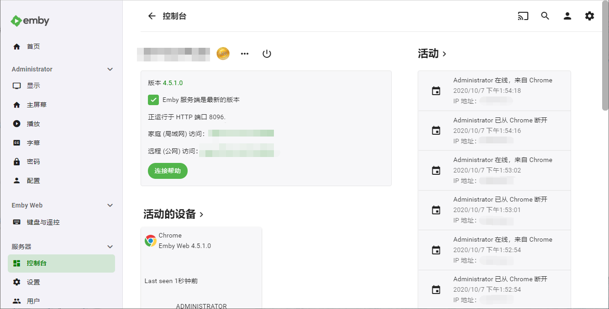
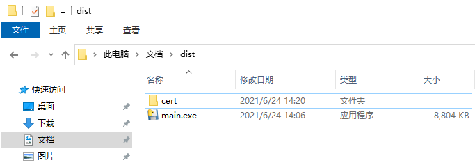
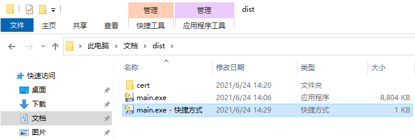
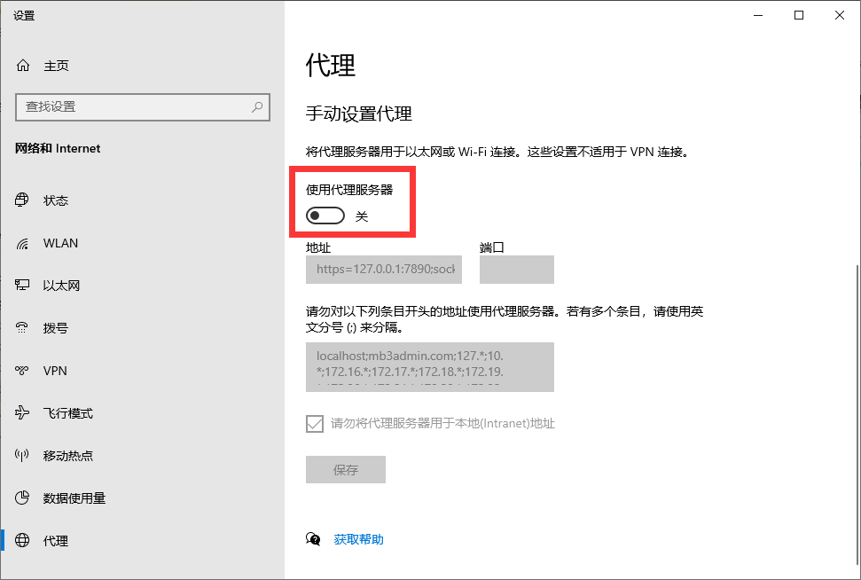
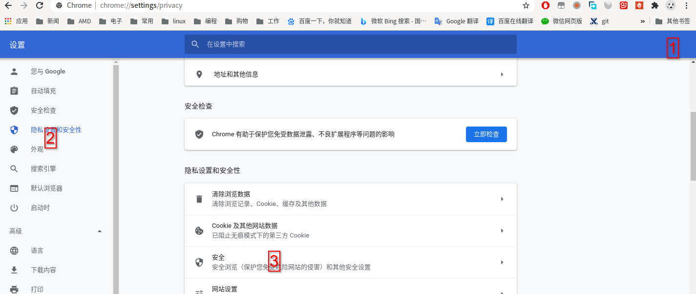
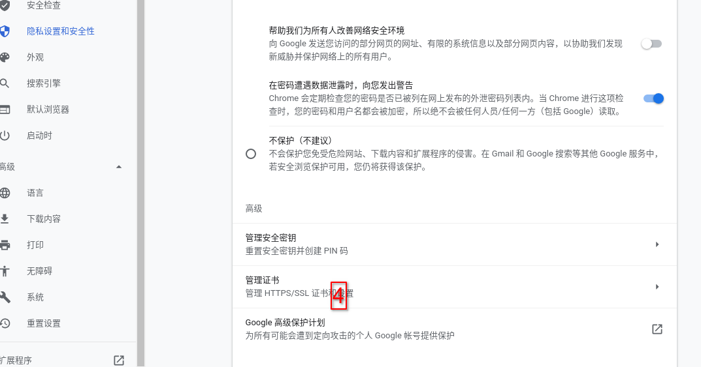
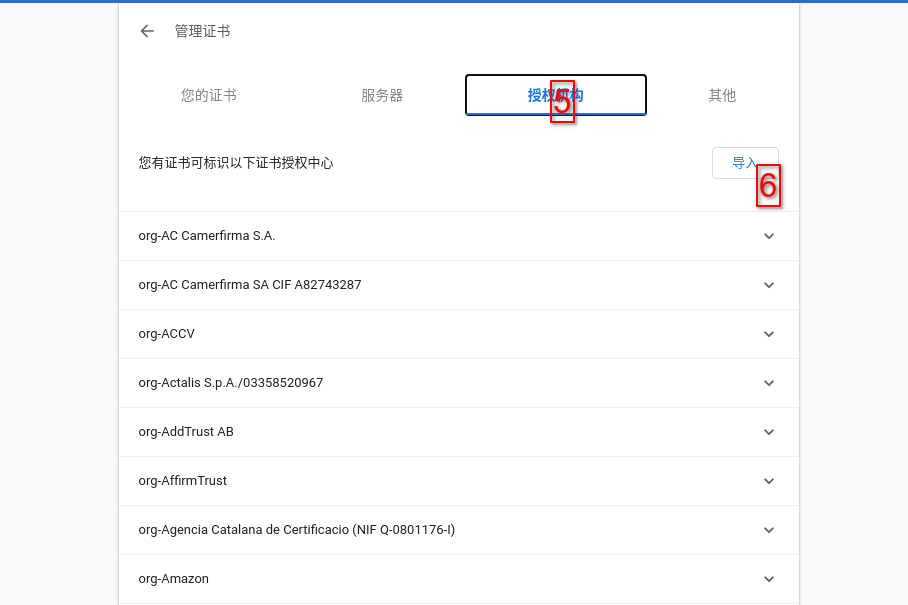
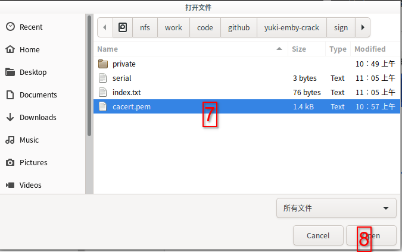
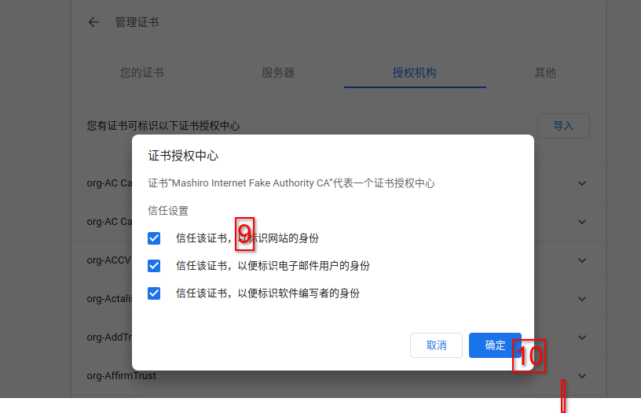
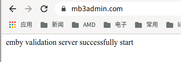

# yuki-emby-crack

> **安全性警告**：使用公共仓库中的CA证书可能会导致您的网络存在遭受攻击的可能性，请谨慎使用此证书，或自行签发CA证书使用！

> **Security Warning**: using the CA certificate in the public repository may lead to the possibility of your network being attacked. Please use this certificate with caution, or create a CA certificate yourself!

Windows简单白嫖Emby会员

原理出自这篇博客：[白嫖一下Emby](https://imrbq.cn/exp/emby_hack.html) ，有兴趣可以去看看

代码实现基于tornado+pyinstaller

## 使用效果

> Emby Server



> Emby Theater


## 使用方法

### 1. 解压缩文件

在[`release`](https://github.com/MitsuhaYuki/yuki-emby-crack/releases) 页面下载`dist.zip`，解压缩至`C:\Users\<UserName>\Documents\dist`(即文档文件夹)



双击`main.exe`运行程序，在Windows上可能会弹出防火墙设定，两个全勾选允许通过即可

> 注意：此处的程序解压缩路径可以随意修改，不过只能放在C盘个人文件夹或除C盘以外的其他磁盘分区，否则可能会因为权限不足而无法启动

### 2. 设置开机自启动

右键`main.exe`，选择`创建快捷方式`，将得到的`main.exe - 快捷方式`复制到`C:\ProgramData\Microsoft\Windows\Start Menu\Programs\StartUp`目录




> 注意：完成后设置开机自启动后请先双击`main.exe`来完成首次启动！

### 3. 修改Host指向

进入`C:\Windows\System32\drivers\etc`目录，修改hosts文件，**在文件末尾增加**如下内容：

```
127.0.0.1 mb3admin.com

```

> 注意此处`127.0.0.1 mb3admin.com`后面需要加一个空行，不然有可能会出现修改不生效的神奇问题

### 4. 安装证书

在[`release`](https://github.com/MitsuhaYuki/yuki-emby-crack/releases) 页面下载和`dist.zip`一同发布的`guomi.cer`证书文件，双击证书文件并选择`安装证书`，在弹出的窗口中依次选择`当前用户`-`将所有证书都放入下列存储`，单击`浏览`并选择到`受信任的根证书颁发机构(如下图)`，然后依次单击`确定`-`下一步`-`完成`来完成证书的安装


至此重新启动位于本机的EmbyServer你会发现小金标应该已经有了，如果没有出现的话可以到Emby控制台中的Emby Premiere里面随便输入任意字符点击验证即可

## 常见问题

### 激活失败

#### STEP1：检查程序是否正常启动

打开任务管理器，往下找，如果程序正常启动的话你应当能看到标有`main.exe`字样的进程


如果没有的话代表你设置自启动的那一步存在问题，或者如果你想要手动启动的话请手动双击`main.exe`来启动程序

#### STEP2：检查host是否正确设定

按下`win`+`r`键输入`cmd`并回车来打开cmd窗口，输入`ping mb3admin.com`，应当能得到如下结果


如果结果不是`来自 127.0.0.1 的回复`字样则代表你的hosts文件设置存在问题，请按照教程重新设定host文件

#### STEP3：检查是否存在代理问题

如果以上检查都没有问题，则打开浏览器访问[`https://mb3admin.com/`](https://mb3admin.com/) ，如果出现错误点击`高级`-`继续访问`，此时应该出现如下内容


如果没有出现对应内容且STEP1和2都没有出现问题，请检查你是不是使用了某些代理插件，关闭它们之后重启浏览器再试一次。如果依旧存在问题可以手动进入`Windows设置`-`网络和Internet`-`代理`，将`使用代理服务器`设为关闭，之后重启浏览器再试一次



#### STEP4：还有问题？

那我就没法解决了，毕竟我也没遇到过#笑，请自行解决~

可以使用CMD以`main.exe > log.txt 2> errorlog.txt`命令运行程序，结束后会生成对应的log文件，可以帮助你检查问题。

## 附加信息

### 关于本项目？

项目基于Python FastAPI框架，寥寥几行无需多讲，无非是加载证书创建web服务器返回一个已激活的信息而已。搞这个东西的初衷也只是为了在windows上的激活更简单一些，经测试可以激活安装在windows上的Emby Server/Emby Theater，原理基于[白嫖一下Emby](https://imrbq.cn/exp/emby_hack.html) 。如非必要本项目一般**不会再次更新**，以及**不会提供技术支持**

### 自行编译？

当然可以，项目使用Python3.8.9，你可以使用pycharm加载该项目，在`terminal`执行

```shell
pip install -r requirements.txt
```

然后运行执行命令

```shell
pyinstaller -F main.spec -w --clean
```

然后你就能在`dist`目录找到编译好的exe文件了，但是还是要配合证书使用

### 关于证书？

证书偷懒了，直接使用了来自于 [embyonekey](https://github.com/s1oz/embyonekey) 项目的证书，如果担心证书存在安全问题，可以依据开头引用的博客中的指引自行申请证书，并替换`cert`目录下的证书文件并重新编译。注意，修改激活服务器证书需要同时签发对应的CA证书以用于客户端激活。

### 关于常见问题-STEP3

我也是偶然发现这个问题，实际上并不是说不能同时使用代理，翻找一下你使用的插件，只需要让你的插件不再代理`mb3admin.com`这个网址即可，例如我使用的Clash for Windows中在Settings里面就有设置系统代理bypass选项，只需要加一行`  - mb3admin.com`即可，如果你没在浏览器页面中看到小金标，看看是不是用了SwitchyOmega或者其他类似插件，如果有的话将`mb3admin.com`加入`不代理的地址列表`，然后刷新页面就能看到小金标啦

### 关于本项目的扩展

从`附加问题-关于本项目`中，有提到这个项目的工作原理。实际上所有emby大家族产品都是同样的激活原理，即向特定激活网址发送请求验证当前客户端的激活信息，而本项目就是充当那个“特定激活网址”的角色。

所以在Windows上，可以通过开放防火墙443端口的方式，将此项目暴露至局域网环境，通过修改同一局域网内其他设备的host即可激活同一局域网内任一设备上的emby程序，具体操作可以自己搜索，此处不再赘述。

## 关于Linux根证书导入失败问题

**此部分教程由 [godvmxi](https://github.com/godvmxi) 编写，在此表示感谢**

### 根证书自签
发现ubuntu下Ca证书一直导入失败，干脆自己签发了一个，参考[OpenSSL 自签 CA 及 SSL 证书](https://2heng.xin/2018/12/16/your-own-ca-with-openssl/)

**关于证书的信任问题，我直接写了个一个小脚本，你自己签发就可以了，window下，自己参考着命令改就行了**

#### 检查openssl设置
创建或者检查/etc/ssl/openssl.cnf

```bash

[ CA_default ]
 
dir             = ./demoCA              # Where everything is kept
certs           = $dir/certs            # Where the issued certs are kept
crl_dir         = $dir/crl              # Where the issued crl are kept
database        = $dir/index.txt        # database index file.
new_certs_dir   = $dir/newcerts         # default place for new certs.
certificate     = $dir/cacert.pem       # The CA certificate
serial          = $dir/serial           # The current serial number
crlnumber       = $dir/crlnumber        # the current crl number
crl             = $dir/crl.pem          # The current CRL
private_key     = $dir/private/cakey.pem# The private key
RANDFILE        = $dir/private/.rand    # private random number file

```

#### 签发自定义Ca
打开root.conf 更改你感兴趣的地方,然后运行./selfsign_ca.sh，一路回车确定完成
```bash
./selfsign_ca.sh

初始化Ca目录


生成 CA 根密钥

Generating RSA private key, 2048 bit long modulus (2 primes)
.............................+++++
...+++++
e is 65537 (0x010001)

自签发 CA 根证书

You are about to be asked to enter information that will be incorporated
into your certificate request.
What you are about to enter is what is called a Distinguished Name or a DN.
There are quite a few fields but you can leave some blank
For some fields there will be a default value,
If you enter '.', the field will be left blank.
-----
Country Name (2 letter code) [CN]:
State or Province Name (full name) [Shanghai]:
Locality Name (eg, city) [Shanghai]:
Organization Name (eg, company) [Mashiro LLC]:
Common Name (e.g. server FQDN or YOUR name) [Mashiro Internet Fake Authority CA]:

重命名ca, pem == crt in linux

'./demoCA/private/cakey.pem' -> './demoCA/private/cakey.crt'

Ca目录

demoCA/
├── cacert.pem
├── index.txt
├── newcerts
├── private
│   ├── cakey.crt
│   └── cakey.pem
└── serial

2 directories, 5 files

```

#### 建立配置文件
进入到sign目录，建立一个你对应的域名目录,并复制server.conf到对应目录,修改对应条目
```bash
mkdir mb3admin.com
cp server.cf mb3admin.com/server.conf
```
更新下列参数
```bash
commonName_default          = *.mb3admin.com
DNS.1   = *.mb3admin.com
DNS.2   = mb3admin.com
```
#### 生成根证书
```bash
selfsign_host.sh mb3admin.com
````
####  证书格式的转换

这里我用的linux，格式一样，如果遇到不一致，可以参考如下解决[证书格式转换DER，PEM等](https://blog.csdn.net/xiangguiwang/article/details/76400805/)

### 使用 Chrome 导入根证书

依次点击设置->隐私设置与安全性->安全->安全证书管理->授权机构->导入







然后可以用浏览器打开https://mb3admin.com 验证是否有错误



